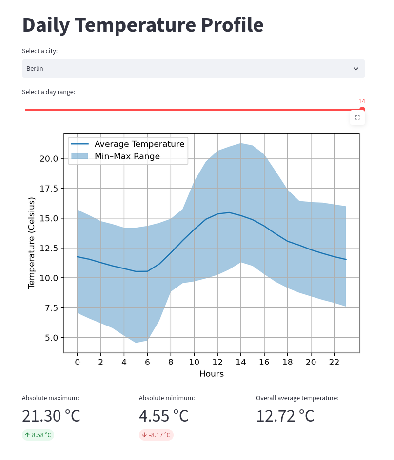

# Germany Weather Dashboard
[](https://germany-weather-profile.streamlit.app/)

An interactive dashboard built with Streamlit to visualize 24-hour diurnal temperature profiles across major German cities using forecast data from the Open-Meteo API.


## What It Does

- **Diurnal Temperature Profile:** Aggregates hourly forecast data into an average 24-hour curve with a shaded min–max variation range.
- **Summary Metrics:** Calculates absolute maximum, absolute minimum, and overall average temperature for the selected forecast period.
- **Interactive Controls:** Allows selecting from 15 German cities and adjusting the forecast horizon (3 to 14 days).
- **Efficient Retrieval:** Uses `openmeteo-requests` with local caching (`requests-cache`) and retry logic to avoid redundant network calls.

## Tech Stack

- **Python**
- **Streamlit** (UI)
- **NumPy** (vectorized array transformations)
- **Matplotlib** (profile visualization)
- **Open-Meteo API** (weather data source)

## Run Locally

```bash
git clone https://github.com/nishoa/Germany-Weather-Dashboard.git
cd germany-weather-dashboard

python -m venv venv
source venv/bin/activate  # On Windows: venv\Scripts\activate

pip install -r requirements.txt
streamlit run app.py
